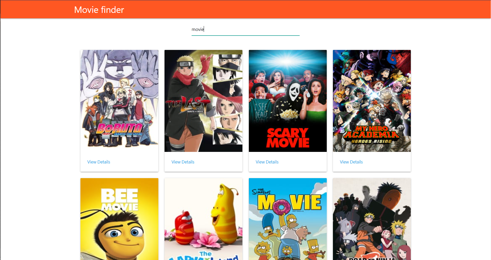

# Movie finder

> A movie finder app that consumes The [TMDb](https://www.themoviedb.org/), fetches data and display on the frontend.



## 2. Built With

- [Create-React-App ~ C.R.A](https://reactjs.org/docs/create-a-new-react-app.html)
- [TMDb API](https://www.themoviedb.org/)
- [fetch](https://developer.mozilla.org/en-US/docs/Web/API/Fetch_API/Using_Fetch)
- [Netlify](https://www.netlify.com/) for deployment.
- [HTML/DOM](https://www.w3schools.com/js/js_htmldom.asp) - Manipulation for UI.
- [Eslint](https://eslint.org/) for linter checks and style guides.

## 3. Pre-requisites

- A code editor.
- Chrome Web Browser.
- Have NodeJS installed locally.
- Basic to intermediate JavaScript skills.

**Below are the instructions on how to play the game and also setting it up locally.**

### Build Dependencies 🚧

***The only dependencies are NodeJS & yarn. Any NodeJS LTS version will work. Clone this repo and run npm install.***

- To get a local copy up and running, follow these simple example steps.

### Setup and installation

```
git@github.com:christianotieno/tracker-client.git
```

### Install dependencies

```
yarn install
```

### Run the app in the development mode

```
yarn start
```

Open [http://localhost:3000](http://localhost:3000) to view it in the browser.

### Run linter checks

```
npx eslint .
```

### Deployment

```
yarn build
```

The command builds the app for production to the `build` folder.
It correctly bundles React in production mode and optimizes the build for the best performance.

The build's minified and the filenames include the hashes.
Your app is ready to be deployed!

|  APP NAME | BUILD STATUS: |
|   :---:   |    :---:     |
|**movie-finder** |  |

---

## 7. Live link

[Link to Live Page]()

---

## 8. Author Section

👤 **Christian Otieno**

- Github: [christianotieno](https://github.com/christianotieno)
- Twitter: [@iamchrisotieno](https://twitter.com/iamchrisotieno)
- LinkedIn: [Christian Otieno](https://www.linkedin.com/in/christianotieno/)

---

## 9. 🤝 Contributing

Contributions, issues and feature requests are welcome!

Feel free to check the [issues page](https://github.com/christianotieno/movie-finder/issues).

---

## 10. Show your support

Give a ⭐️ if you like this project!